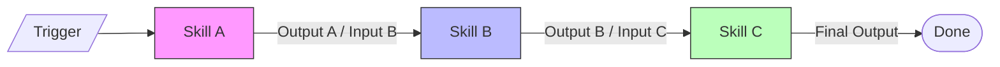

# Skill Chain Rules

## Purpose
Define how standalone skills connect sequentially to automate complex multi-step workflows.

## How It Works
Skills execute in a pipeline where the output of one skill serves as the input to the next skill. A circuit breaker monitors execution and halts the chain if any step fails.

## Rules
1. **Length Limit**: A chain must not exceed 5 skills in a single sequence.
2. **Strict Interface**: Each skill in the chain must declare compatible input and output formats.
3. **Circuit Breaker**: If any skill in the chain returns a fail status, execution stops immediately.
4. **Trigger Actions**: Chains are activated via the `/chain` command or by auto-detected sequences.
5. **No Loops**: Recursive chaining or looping within a single chain execution is prohibited.

## Inputs/Outputs
| Component | Format | Description |
|---|---|---|
| Input | JSON / Context Object | Initial state and parameters for the first skill |
| Output | JSON / Report Object | Final state generated by the last skill in the chain |

---
Last reviewed: June 2026 | Review by: September 2026 | Owner: Mel
