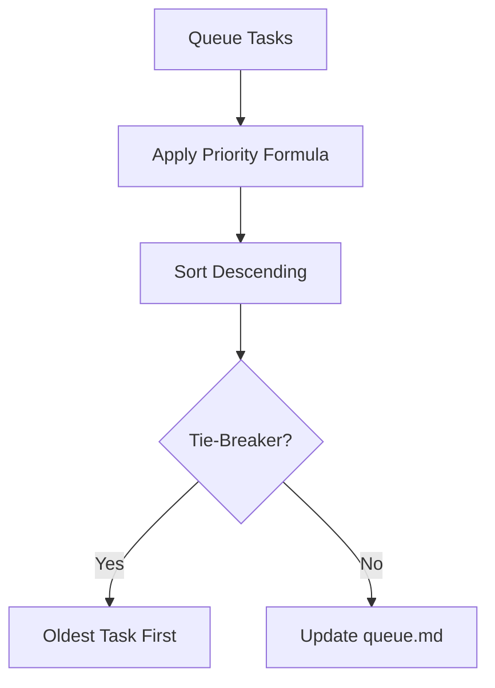

# Priority Algorithm

## Purpose
Define the mathematical logic and scoring factors to auto-rank tasks within the queue.

## How It Works
The engine evaluates each task in the queue and computes a priority score using a weighted formula. Tasks are then sorted in descending order of their scores.

## Rules
1. **Scoring Scale**: Each factor (Urgency, Impact, Dependency, Effort) must be evaluated on a scale of 1 to 5.
2. **Formula**: The priority score is calculated as:
   $$\text{Score} = (\text{Urgency} \times 3) + (\text{Impact} \times 2) + (\text{Dependency} \times 1) - (\text{Effort} \times 0.5)$$
3. **Execution Ordering**: The task with the highest priority score is executed first.
4. **Tie-Breaker Rule**: If two or more tasks have identical scores, the oldest task (by date added) takes priority.

## Inputs/Outputs
| Component | Input Format | Output Format |
|---|---|---|
| Priority Engine | Unsorted list of tasks with metadata (Urgency, Impact, Dependency, Effort) | Sorted list of tasks ordered by highest priority score |

---
Last reviewed: June 2026 | Review by: September 2026 | Owner: Mel
