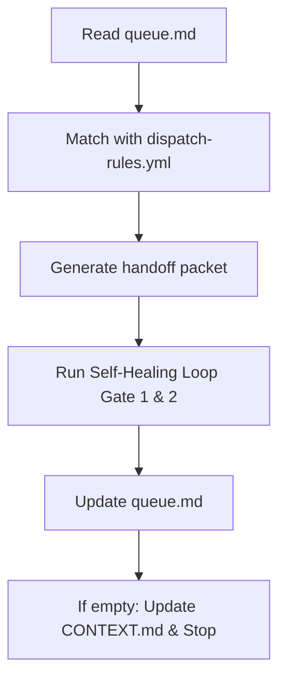

# Session Conductor

## Purpose
Guide the Builder through routing tasks and generating handoffs at the start of each session.

## How It Works
The Conductor coordinates the flow of tasks from queue to execution through the following pipeline:

## Conductor Rules
1. **Queue Scan First**: The Builder must read `queue.md` for any pending tasks before starting work.
2. **Apply Dispatch Rules**: Match each task against the routing table in `dispatch-rules.yml` to select the right agent.
3. **Template-Driven Handoffs**: Populate the matching handoff template with task details and token budget.
4. **Self-Healing Loop Gatekeeping**: Run all development through the Dual-Gate Self-Healing Loop (Gate 1 Plan Check + Gate 2 File Audit).
5. **Log Activity**: Update `queue.md` by marking completed tasks and recording time/token metrics.
6. **Session Checkpoint**: When the queue is empty, update `CONTEXT.md` and stop the session.

## Inputs/Outputs

| Inputs | Outputs |
|---|---|
| Active tasks in `queue.md` | Handoff packets from templates |
| `dispatch-rules.yml` routing table | Updated task status in `queue.md` |
| Handoff templates | Updated `CONTEXT.md` |

---
Last reviewed: June 2026 | Review by: September 2026 | Owner: Mel
