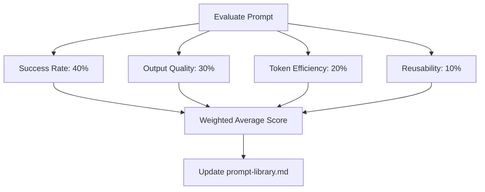

# Prompt Scoring

## Purpose
Define the evaluation criteria and scoring weights to calculate prompt effectiveness.

## How It Works
The engine evaluates prompts across four key metrics. These scores are combined into a weighted average to determine a prompt's overall score.

## Scoring Criteria
- **Success Rate (40%)**: Did the prompt produce a correct output without requiring manual revision? (Scale: 1-10)
- **Output Quality (30%)**: Rating of prompt output alignment, tone, and accuracy. (Scale: 1-10)
- **Token Efficiency (20%)**: Tokens consumed versus the minimum necessary tokens. (Scale: 1-10)
- **Reusability (10%)**: Frequency of prompt reuse in other tasks. (Scale: 1-10)

## Rules
1. **Weighted Average Formula**:
   $$\text{Overall Score} = (\text{Success Rate} \times 0.4) + (\text{Output Quality} \times 0.3) + (\text{Token Efficiency} \times 0.2) + (\text{Reusability} \times 0.1)$$
2. **Min Score Threshold**: Prompts with an overall score below 6.0 after 3 uses are flagged for evolution.
3. **Assessment Time**: Prompts must be scored immediately after completion of a task sequence.

## Inputs/Outputs
| Component | Input Evaluation | Output Scorecard |
|---|---|---|
| Prompt Scorer | Execution logs, token usage count, QA verdict | Overall prompt score out of 10 |

---
Last reviewed: June 2026 | Review by: September 2026 | Owner: Mel
