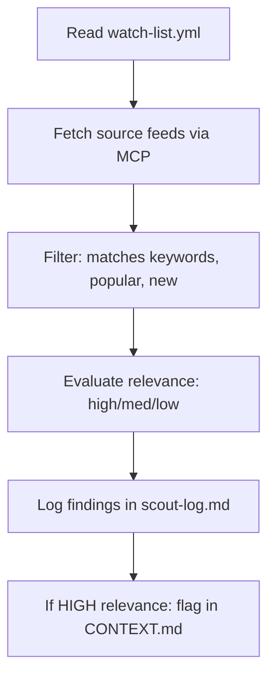

# Scout Engine

## Purpose
Scan the web automatically for new tools, frameworks, and techniques to recommend for adoption in UNGASIS OS.

## How It Works
The Scout Engine runs a scheduled or manual sweep to find and evaluate new tech.

## Scout Rules
1. **Trigger Frequency**: Execute weekly on Sunday evenings, or manually via the `/scout` command.
2. **Relevance Scoring**: Score each match as HIGH, MEDIUM, or LOW based on stack alignment.
3. **Task Threshold**: Evict discoveries that have less than 100 GitHub stars or 50 upvotes.
4. **Token Budget Cap**: Spend at most 1,000 tokens per execution session.
5. **No Auto-Fix / Auto-Install**: NEVER install packages, update dependencies, or change source code automatically.
6. **Limit Discoveries**: Max 10 items can be cataloged per sweep.
7. **Human Approval Checkpoint**: Any adoption must be approved by the human owner.

## Inputs/Outputs

| Inputs | Outputs |
|---|---|
| `.ungasis/scout/watch-list.yml` | Updated `.ungasis/scout/scout-log.md` |
| MCP Fetch Server feeds | Flagged items in next `CONTEXT.md` |
| MCP GitHub Server data | Moved approved items to `adaptation-queue.md` |

---
Last reviewed: June 2026 | Review by: September 2026 | Owner: Mel
