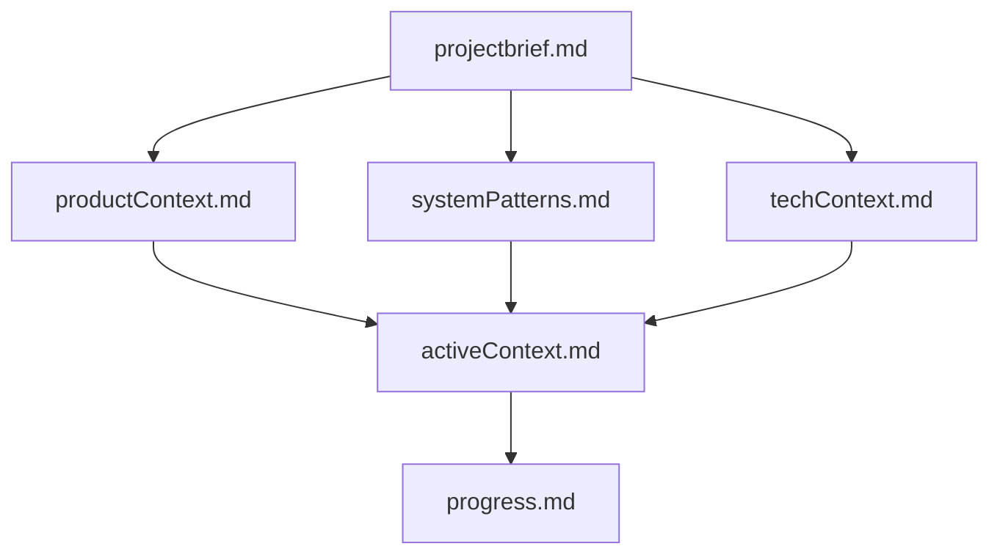
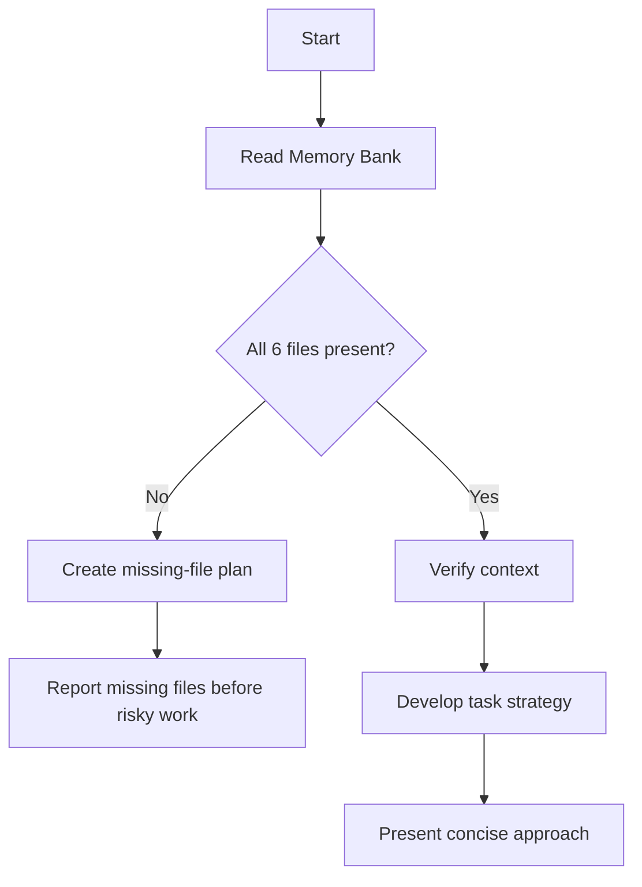
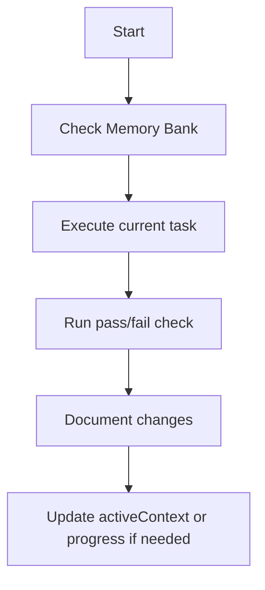
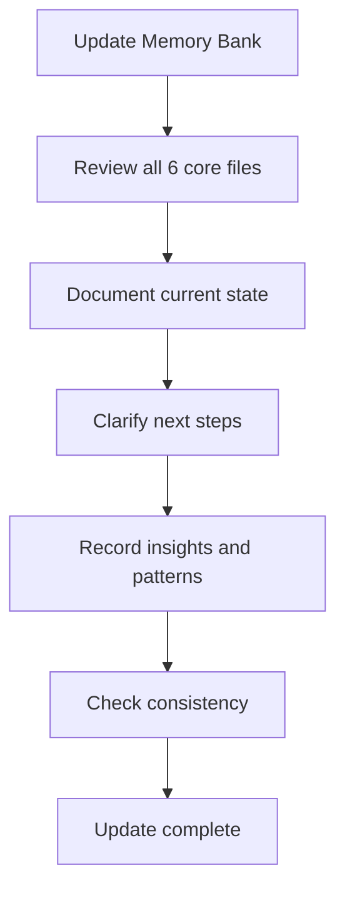

# Cline's Memory Bank — UNGASIS Custom Instructions

## Role

My memory resets completely between sessions. This is not a limitation. It means I must maintain excellent documentation. After each reset, I rely entirely on the Memory Bank to understand the UNGASIS project and continue work effectively.

I MUST read all Memory Bank files at the start of every task. This is not optional.

## Important Install Note

This file is stored at `memory-bank/.clinerules/memory-bank.md` because the repo setup task requested that path.

⚠️ If Cline does not load nested `.clinerules/` files from inside `memory-bank/`, copy this same file to the repo root path:

```text
.clinerules/memory-bank.md
```

## Memory Bank Structure

The Memory Bank consists of core files and optional context files, all in Markdown format. Files build upon each other in a clear hierarchy:



## Core Files Required

| File | Purpose | Read Priority |
|---|---|---|
| `projectbrief.md` | Foundation, scope, core requirements, source of truth | 1 |
| `productContext.md` | Why the project exists, problems solved, UX goals | 2 |
| `systemPatterns.md` | Architecture, patterns, file hierarchy, critical paths | 3 |
| `techContext.md` | Stack, setup, constraints, dependencies, tool patterns | 4 |
| `activeContext.md` | Current focus, recent decisions, next steps | 5 |
| `progress.md` | What works, what is pending, issues, decision evolution | 6 |

## Startup Rule

Before doing any task:

1. Read all 6 core Memory Bank files.
2. Confirm the current task against `activeContext.md`.
3. Check current status and known issues in `progress.md`.
4. Follow `.clinerules/`, `AGENTS.md`, and `CLAUDE.md` if present.
5. Do not ask Mel to paste content that is already in files.

## Plan Mode Workflow



## Act Mode Workflow



## Documentation Updates

Update Memory Bank when:

1. A significant milestone is completed.
2. A project direction changes.
3. A new architecture or agent pattern is discovered.
4. Mel says `update memory bank`.
5. Current context is unclear or drifting.
6. A known bug, blocker, or decision changes.

When Mel says `update memory bank`, I MUST review all 6 core files, even if only some need edits. Focus especially on:

- `activeContext.md`
- `progress.md`

## Update Process



## UNGASIS-Specific Rules

| Rule | Action |
|---|---|
| Beginner-friendly | Use simple English, tables, checklists, and analogies |
| $0 budget | Do not recommend paid tools unless Mel explicitly asks |
| No local installs | Prefer GitHub Codespaces and browser tools |
| Source protection | Never modify `source-files/` |
| Secrets protection | Never expose API keys, tokens, credentials, or connection strings |
| Human approval | Do not push, delete, change permissions, or run destructive actions without approval |
| Token efficiency | Use Glob → Grep → Read partial → Read full, in that order when possible |
| Output durability | Write important outputs to files, not only chat |
| Verification | Every task must have a pass/fail check |
| Unverified claims | Mark uncertain or volatile claims with ⚠️ |

## Missing File Behavior

If any required Memory Bank file is missing:

1. Do not invent project state silently.
2. Create a short missing-file list.
3. Recreate the missing file only from available repo evidence and Mel's current instructions.
4. Mark uncertain items with ⚠️.
5. Ask for confirmation only if the missing data blocks safe progress.

## Staleness Behavior

If a Memory Bank file looks stale:

1. Mark the stale item with ⚠️.
2. Prefer the newest explicit user instruction.
3. Prefer current repo files over old chat memory.
4. Update `activeContext.md` and `progress.md` after important corrections.

## Completion Rule

After completing a task:

1. Re-check the user's acceptance criteria.
2. Confirm changed files.
3. Log any known gaps.
4. Update Memory Bank if the task changed project state.
5. Keep the final response short and actionable.

---

Last reviewed: June 2026 | Review by: September 2026 | Owner: Mel
