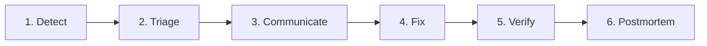

# Observability & Incident Response — Smoke Alarms and Fire Drills

## 1. Kitchen Analogy
A professional kitchen has safety gear installed to handle emergencies:
- **Smoke Alarms (Observability):** They constantly monitor the air. If smoke is detected, they beep before a fire spreads.
- **Fire Extinguishers (Quick Fixes):** Available on the wall to put out small flames instantly.
- **Evacuation Plans (Incident Response):** Step-by-step instructions so the staff knows exactly how to escape safely and who to call.

---

## 2. Monitoring Stack

We use these tools to observe our application's health:

| Tool | Purpose | What it Monitors | When to Check |
|---|---|---|---|
| **PostHog** | Analytics | User behavior and clicks | Weekly review |
| **Sentry** | Error Tracking | Code crashes and backend errors | Immediately on alert |
| **Firebase Performance** | Speed Tracking | Page load times and API latency | Monthly checkup |
| **Google Search Console** | SEO Monitoring | Google search presence and indexing issues | Monthly checkup |

---

## 3. Incident Severity Levels

| Severity | Impact | Meaning | Response Time | Action |
|---|---|---|---|---|
| **S1** | Critical | The application is completely down. Users cannot access it. | < 15 minutes | Trigger kill switch, rollback last change, notify owner. |
| **S2** | Major | A core feature is broken (e.g., checkout page fails). | < 1 hour | Assign developer, push a hotfix, or rollback. |
| **S3** | Minor | A non-critical feature is broken or styled wrong. | < 24 hours | Add to task board for the next minor update. |
| **S4** | Trivial | A simple typo or cosmetic alignment issue. | Next release | Fix when editing related files. |

---

## 4. Incident Response Steps
When something breaks, follow this checklist:

1. **Detect:** Notice the issue via alerts (Sentry) or user complaints.
2. **Triage:** Decide the severity level (S1-S4) and assign an owner.
3. **Communicate:** Alert the team and post status updates for users if needed.
4. **Fix:** Apply a temporary patch, disable the feature, or roll back to the last working version.
5. **Verify:** Run automated tests to prove the bug is gone and no new bugs were introduced.
6. **Postmortem:** Document what went wrong, why it happened, and how to prevent it next time.

---

## 5. Cross-References
- [kill-switch.yml](file:///c:/Users/63905/Downloads/ungasis/config/kill-switch.yml) — Configure the master switch to disable features during an active incident.
- [circuit-breaker.yml](file:///c:/Users/63905/Downloads/ungasis/config/circuit-breaker.yml) — Configure automated failures fallback to protect the app.
- [INCIDENT_RESPONSE.md](file:///c:/Users/63905/Downloads/ungasis/docs/INCIDENT_RESPONSE.md) — Documenting incident details template.

---

Last reviewed: June 2026 | Review by: September 2026 | Owner: Mel
