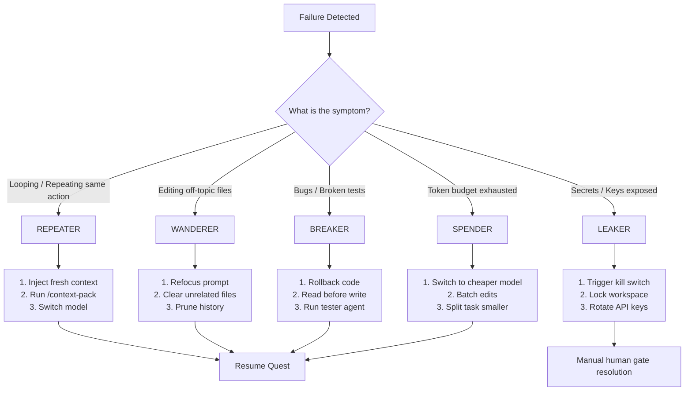

# Failure Taxonomy — When Things Go Wrong

## 1. Kitchen Analogy
In a busy restaurant kitchen, many things can go wrong. How the crew responds determines whether the restaurant survives or closes down:
- **The Stuck Mixer (Repeater):** A machine keeps beating the same dough over and over until it burns. You need to turn it off, clear the bowl, and add fresh ingredients.
- **The Distracted Cook (Wanderer):** The chef starts cleaning the floor or chopping carrots for tomorrow instead of cooking the order on the ticket. You must point them back to the active order.
- **The Burned Dish (Breaker):** The chef changes the recipe and burns a signature dish. You must throw it away, pull up the standard recipe, and cook it again.
- **The Spilled Secret Recipe (Leaker):** A worker accidentally leaves the restaurant's secret sauce recipe on a counter where customers can see it. You must remove it immediately and change the recipe.
- **The Ingredient Wastage (Spender):** The chef uses up all the premium butter on a simple appetizer, leaving none for the main course. You must switch them to standard ingredients or break the menu into smaller portions.

---

## 2. Failure Categories Table

| Category | Name | Symptom | Root Cause | Immediate Fix | Reference Config |
|---|---|---|---|---|---|
| **Category 1** | **REPEATER** | Same file edited 3+ times, or same error message repeated. | Agent lost context or is stuck in an error loop. | Inject fresh context, try a different model, or use `/context-pack`. | [progress-detection.yml](file:///c:/Users/63905/Downloads/ungasis/config/progress-detection.yml) (`repeater.threshold`) |
| **Category 2** | **WANDERER** | Working on unrelated files, features, or folders. | Vague prompt instructions or context window is full. | Refocus with a specific task description; reduce active context. | [progress-detection.yml](file:///c:/Users/63905/Downloads/ungasis/config/progress-detection.yml) (`wanderer.max_off_topic`) |
| **Category 3** | **BREAKER** | Tests fail after edits, or existing features break. | Agent did not read the existing files fully before editing. | Rollback the changes, enforce safety gate (read before write), run test suite. | [kill-switch.yml](file:///c:/Users/63905/Downloads/ungasis/config/kill-switch.yml), [circuit-breaker.yml](file:///c:/Users/63905/Downloads/ungasis/config/circuit-breaker.yml) |
| **Category 4** | **LEAKER** | API keys, passwords, or private files in the chat output. | Agent read `.env` or config files and repeated details. | Immediate kill switch trigger, scrub logs, rotate any exposed keys. | [kill-switch.yml](file:///c:/Users/63905/Downloads/ungasis/config/kill-switch.yml) (`triggers.secret_detected`) |
| **Category 5** | **SPENDER** | Session tokens depleted but the task is not finished. | Verbose responses, re-reading large files, not batching edits. | Switch to cheaper model tier, enforce 12-layer token rules, split task. | [token-budget.yml](file:///c:/Users/63905/Downloads/ungasis/config/token-budget.yml) (`warning_threshold`, `hard_cap`) |

---

## 3. Recovery Decision Tree

---

Last reviewed: June 2026 | Review by: September 2026 | Owner: Mel
